# AWS Load Balancing and Auto Scaling

## Introduction

Working with Launch Templates, Target Groups, an Application Load Balancer and an Auto Scaling Group.

## Launch Template

I started by creating a directory, readme file and image folder on vscode,then a Launch Template for my EC2 instances. I used an Amazon Linux AMI and selected `t3.micro` as the instance type. I configured the network settings and used the default security group. I also added the provided HTML code under User Data.

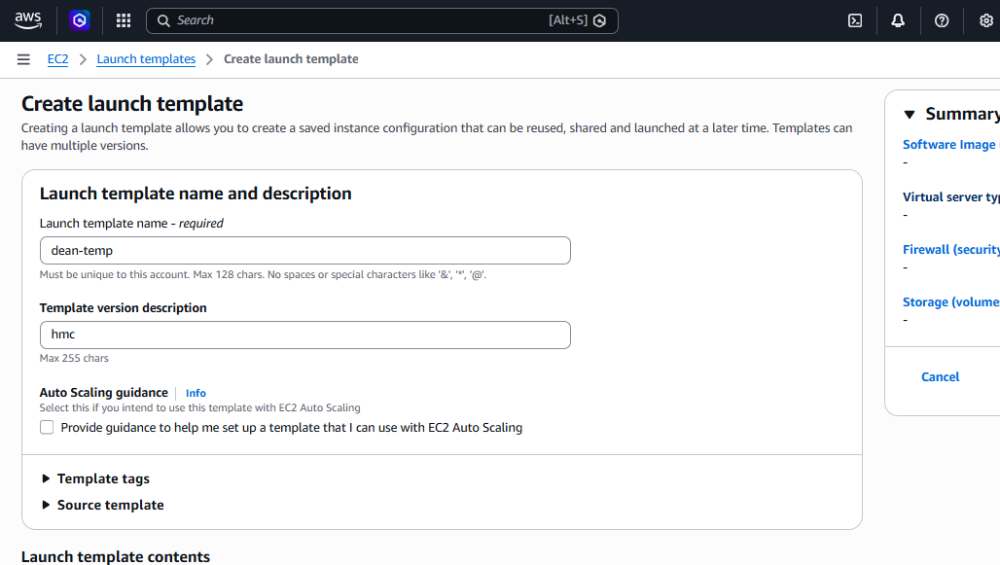
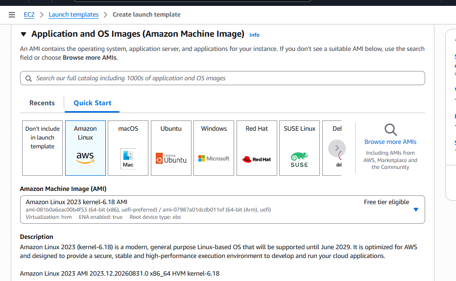
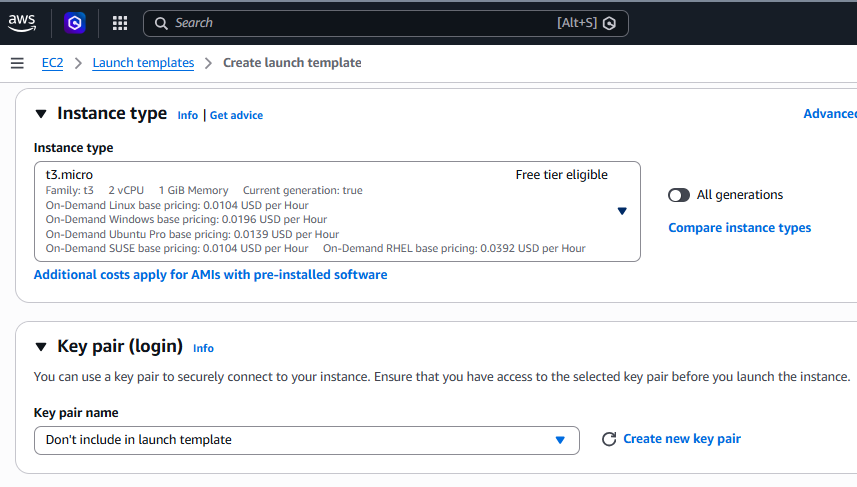
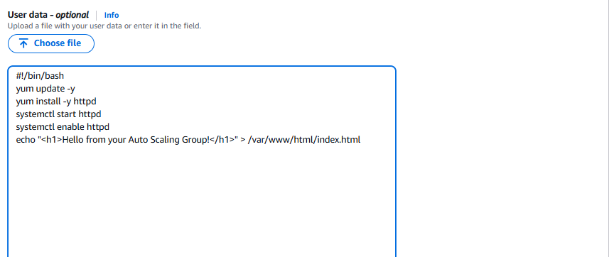
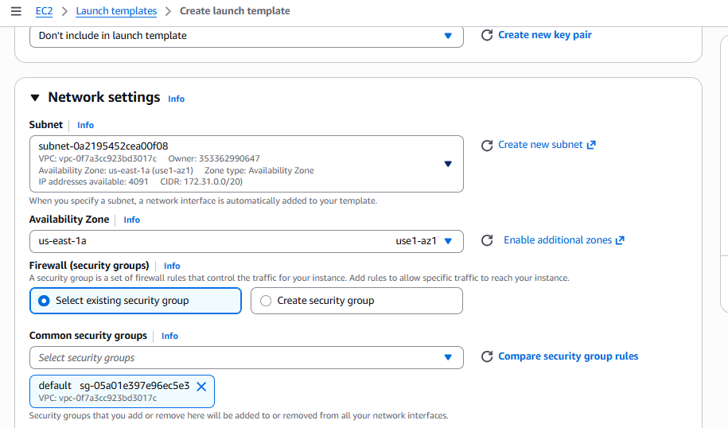
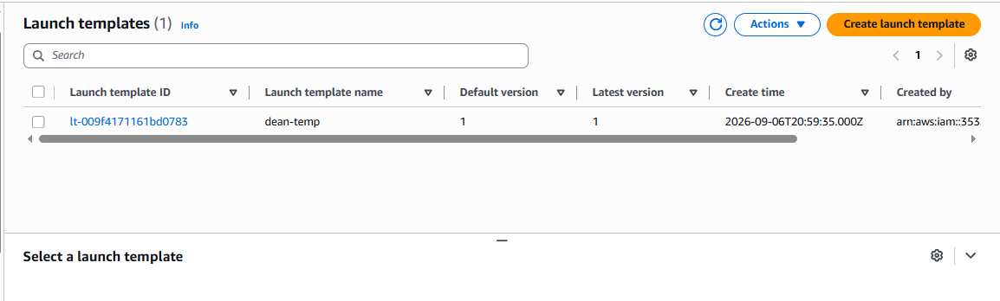

## Target Group

I created a Target Group and selected **Instances** as the target type. I left the other settings at their default values.

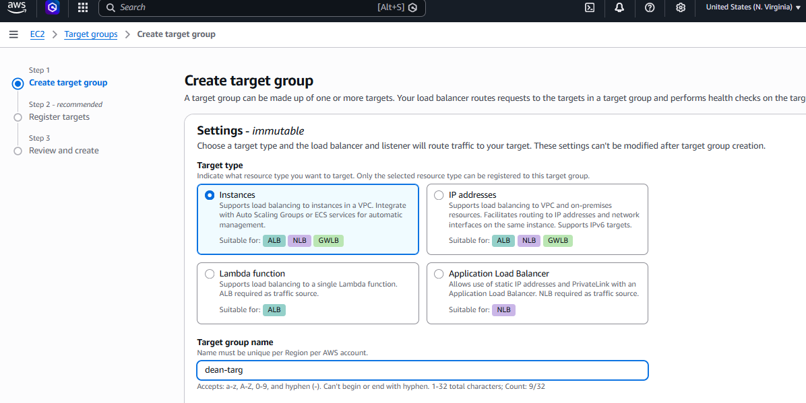
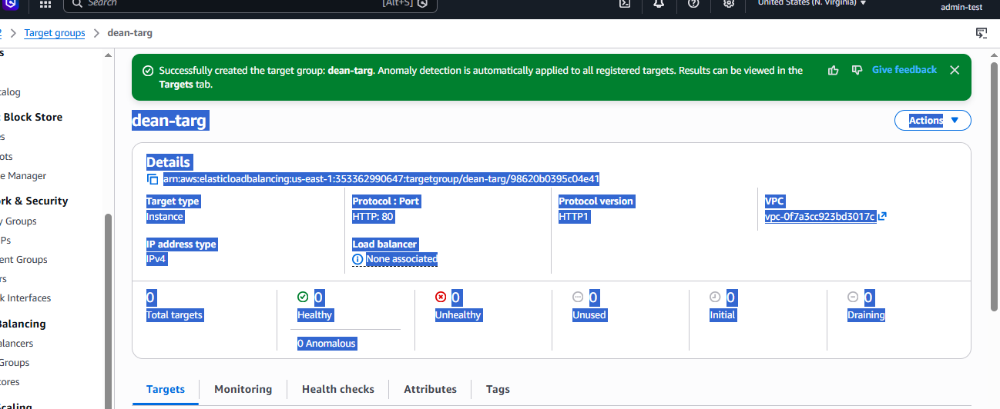

## Application Load Balancer

Next, I created an **Application Load Balancer** and set it to **Internet-facing**. I selected the required Availability Zones and the default security group. I then connected it to the Target Group I created earlier.

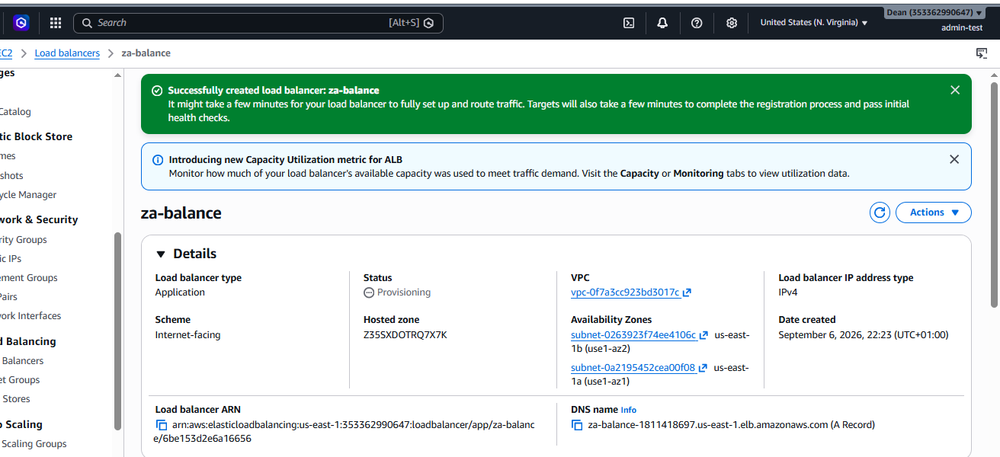

## Auto Scaling Group

I created an Auto Scaling Group using the Launch Template. I selected the default VPC and the `us-east-1a` and `us-east-1b` Availability Zones.
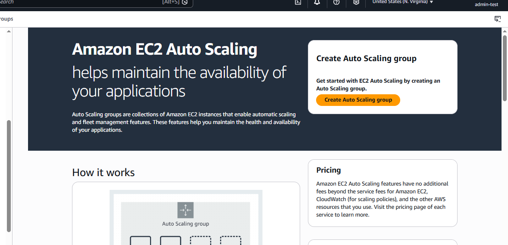
I attached the existing Target Group and enabled the Elastic Load Balancing health check.

For the group capacity, I used:

- Desired: **2**
- Minimum: **1**
- Maximum: **4**

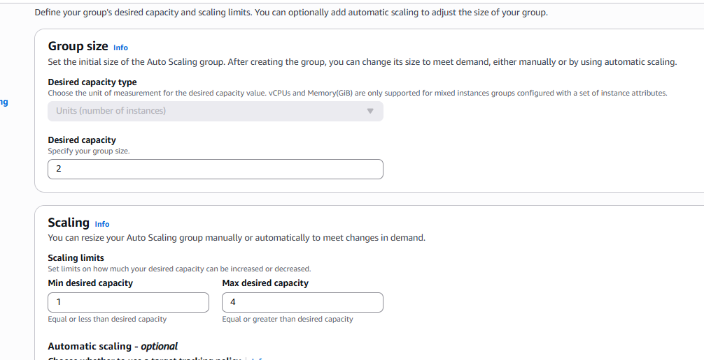

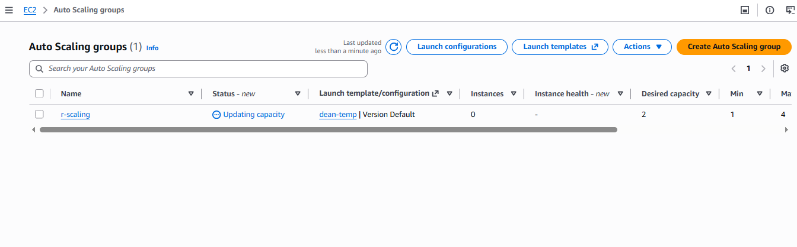
## Testing

After creating the Auto Scaling Group, two EC2 instances were running as expected. I checked their public IPv4 addresses and public DNS names and used them to access the webpage in a browser.

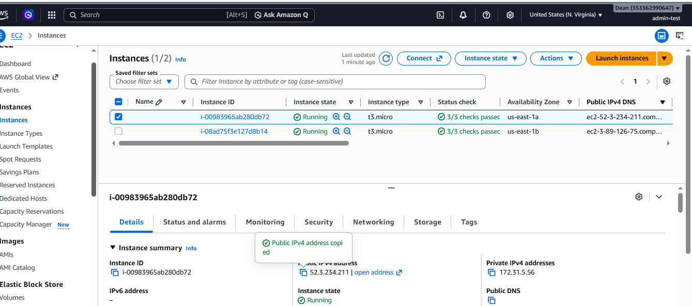

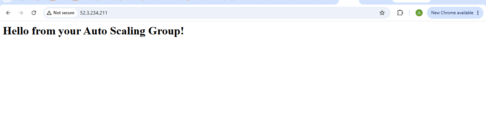
